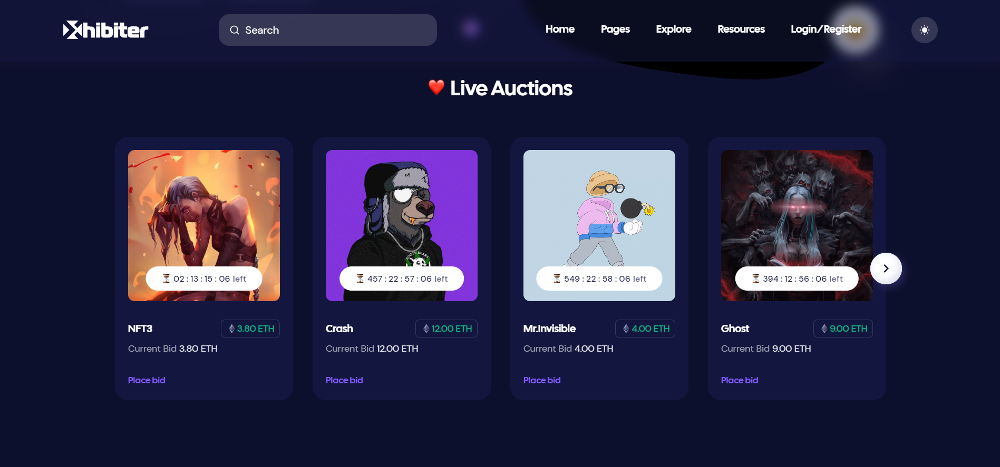

# Xhibiter - NFT Marketplace

Xhibiter is an NFT marketplace that allows users to create, sell, purchase, and auction digital assets in a secure and transparent manner. The platform features a comprehensive set of tools and functionalities, including a wallet system that connects with the Ethereum blockchain using Nethereum and Geth client.

## Features

- **User Authentication:** The platform includes a secure and user-friendly login and registration system to protect users' personal data.
- **Wallet System:** The platform uses Nethereum and Geth client to connect with the Ethereum blockchain, allowing users to manage their cryptocurrency and NFTs in a secure and decentralized manner.
- **Profile Editing:** Users can edit their profiles and manage their personal information, including name, profile picture, and contact details.
- **NFT Creation:** Users can create and mint their NFTs by uploading digital assets and setting the necessary information such as name, description, and price.
- **NFT Editing:** Users can edit their existing NFTs' details such as price, name, and description.
- **NFT Purchase:** Buyers can purchase NFTs using cryptocurrency with a straightforward checkout process.
- **Auction Bidding:** Users can participate in NFT auctions by placing bids and monitoring the auction progress in real-time.
- **Collection Creation and Editing:** Users can create and manage their NFT collections, including setting a cover photo, description, and adding or removing NFTs.
- **Search and Filtering:** Users can use search and filter function to find specific digital assets.
- **Explore Collections:** Users can explore other users' NFT collections and discover new digital assets.
- **Collection Ranking System:** Collections are ranked based on the total value of the NFTs they contain, providing a competitive edge for users to showcase their valuable assets.
- **Admin Panel:** The platform includes an admin panel that allows the platform owner to view user accounts, NFTs, and collections, ensuring a safe and fair environment for all users.

## Getting Started

To get started, please follow these steps:

1. Clone this repository to your local machine.
2. Open the geth-client folder and run the startgeth.bat file to connect to the Ethereum network properly.
3. Import the NFTDB.bacpac file in MSSQL server by following these steps:
   - Open Microsoft SQL Server Management Studio
   - Right-click on Databases and select Import Data-tier Application
   - Follow the instructions and select the NFTDB.bacpac file to import
4. Change the connection string in the appsettings.json file to your server's connection string.
5. Run the project.

## Website Presentation

Please click [here](https://drive.google.com/file/d/1bGqaWYJy5NHbpsOdZVieNLc9-OiSBsTg/view?usp=share_link) to watch my website presentation.

## Design

## Thank you!

Thank you for checking out Xhibiter, the NFT marketplace that i built on the Ethereum blockchain! I hope this README file provided you with all the necessary information to get started with my platform. If you have any questions or feedback, please feel free to contact me at shukurovehtiram29@gmail.com. Happy trading!
